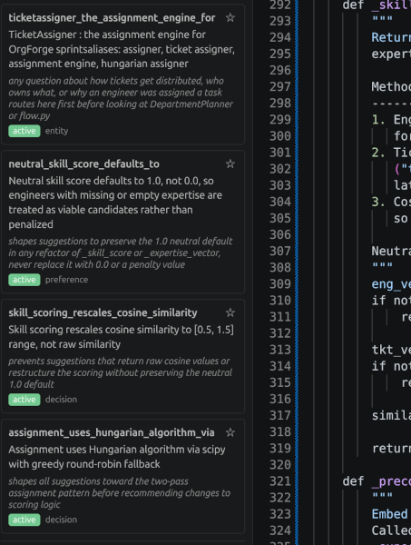
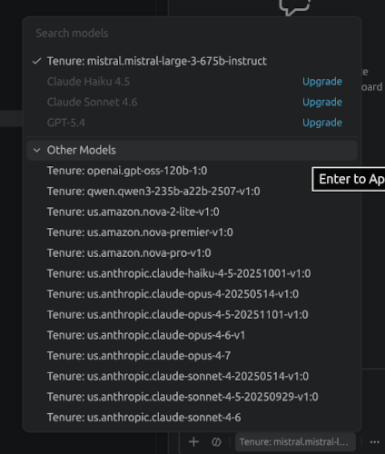

# Tenure

Open-source AI memory layer for engineering teams. Automatically inject
knowledge, coding standards, and project context into every AI session across VS Code, Claude Code, Cursor, Cline, Continue, and other
clients.


---

You brainstorm architecture in a chat client. You open your IDE.
It already knows what you decided. No re-explanation. You just build.

Tenure is a local proxy that sits between your clients and your LLM
provider. It learns from your conversations and injects relevant
context on every request. One container, one port, every tool shares
the same memory.

## 30-second install

**Linux / macOS:**

```bash
curl -fsSL https://raw.githubusercontent.com/tenurehq/tenure/main/scripts/install.sh | bash
```

**Windows (PowerShell):**

```powershell
irm https://raw.githubusercontent.com/tenurehq/tenure/main/scripts/install.ps1 | iex
```

Point your client at `http://localhost:5757/v1`. Done.
Claude Code: point at `http://localhost:5757/anthropic`. Done.

## What your IDE sees



Tenure extracted these from past conversations. The model knows
your scoring uses Hungarian algorithm via scipy, that skill scores
default to 1.0 not 0.0, and that cosine similarity is rescaled to
[0.5, 1.5]. When you ask it to refactor this function, it won't
suggest breaking any of these decisions. No re-explanation required.

## The problem

Every AI session starts from zero. You re-explain your stack. You restate your voice. You re-establish decisions you made weeks ago. And when you don't re-explain, when you just ask the question, you get a confident, detailed answer that completely misses the point.

A developer had already established: TypeScript, Fastify, MongoDB, raw driver, composition over inheritance. New session, they asked:

> _How should I structure my repo?_

200 lines of Python using SQLAlchemy. Wrong language. Wrong database. Wrong paradigm.

The next prompt becomes a correction instead of progress.

## What Tenure does

You spend an hour in a chat interface thinking through an architecture
problem. You explore options, rule some out, land on a direction. Then
you open your IDE to start building.

Tenure is already there. It knows what you decided, what you rejected,
and why. You don't re-explain anything. You just build.

It sits between your clients and your AI provider and quietly learns
from your conversations. Every tool that routes through it shares the
same belief store, so context you establish in one place is already
present when you switch to another. After a month, most users have
eliminated more than 80% of the correction turns they used to pay.

Same question, cold start, new session, with Tenure running:

```typescript
export function makeUserRepository(db: Db): UserRepository {
  const col: Collection<UserDoc> = db.collection("users");

  return {
    async findById(id, ctx) {
      const doc = await col.findOne(
        { _id: new ObjectId(id) },
        { session: ctx?.session }
      );
      return doc ? toUser(doc) : null;
    },
    async insert(data, ctx) {
      const doc: UserDoc = {
        _id: new ObjectId(),
        ...data,
        createdAt: new Date()
      };
      await col.insertOne(doc, { session: ctx?.session });
      return toUser(doc);
    }
  };
}
```

TypeScript. MongoDB raw driver. Factory function. No re-explanation required.

## Works where you already work

- **IDE:** VS Code (native), Cursor, Windsurf, Continue, Cline
- **Chat:** Open WebUI, LibreChat, any OpenAI-compatible client
- **Mobile:** OpenClaw on WhatsApp/Telegram — aha moments on a walk
  land in the same belief store your IDE reads from tomorrow
- **Claude Code:** full Anthropic wire format, works today

One port. Every client. Same memory.

## Works inside your editor



Tenure registers as a native LLM provider. Pick any model through
your own API keys: Anthropic, OpenAI, Mistral, Qwen, Amazon Nova,
whatever you have access to. Same Copilot UX. Memory included.

Already paying for an API key? You don't need a Copilot subscription.
Tenure gives you native editor completions with the model you already
have access to, plus memory that Copilot will never have.

## Claude Code

Tenure has native Anthropic SDK ingress and egress. Claude Code users
point at the same localhost endpoint, no translation layer, no
wrapper. Your agentic sessions accumulate beliefs the same way your
editor sessions do.

The model that spent three hours refactoring your auth service already
knows what it decided by the next session.

## Try it before you commit

Run with extraction on, injection off. See what it learns before
it ever changes a response. No risk, no behavior change.

`!inject off` in any chat, or toggle in the VS Code sidebar.

## How it works (30 seconds)

- Sits between your client and your LLM provider
- Extracts structured beliefs from conversations at write time
- Injects only relevant, scoped beliefs on every request
- Beliefs are scoped: project:my-app can't bleed into project:other
- Supersession: moved from Jest to Vitest? The old belief routes
  to the new one. No contradiction. No stale context.
- 13ms retrieval. BM25 over a structured index. No embedding model.

## Scope

Beliefs are scoped to a context boundary. A belief about your TypeScript
conventions only surfaces in code sessions. A belief about a character's
voice only surfaces in writing sessions. A belief marked `user:universal`
surfaces everywhere.

Scope is a hard filter, not a ranking signal. A session in `project:client-a`
cannot surface beliefs from `project:client-b` regardless of how semantically
close the content is. There is no probabilistic suppression; out-of-scope
beliefs are structurally absent from retrieval.

This matters in practice. If you have a character named Redis in your novel
and Redis the cache in your codebase, the right belief surfaces based on the
active scope, not on which one scores higher in a similarity search.

Scope is detected automatically from your first message or set explicitly:

    !scope domain:code
    !scope project:my-app
    !scope domain:code/typescript

Sub-domain scopes expand automatically — setting `domain:code/typescript`
includes `domain:code` without listing it separately.

Details: [docs/beliefs.md](docs/beliefs.md)

## Private by design

Everything on localhost. Encrypted at rest. Nothing hidden.
Export your entire memory as an encrypted archive anytime.

## Orientation tax dashboard

Tenure tracks re-explanations prevented vs. total required.
Most users hit 80%+ coverage within a month.

## Architecture: beliefs vs. retrieval systems

Vector search, top-k, reranking — that's the retrieval system side.
Tenure is on the belief system side.

Most memory systems store what you said and search it at inference time,
handing the model a pile of candidates to reason over. Contradictions,
alternatives, outdated context — the model sorts it out. When retrieval
is noisy, the model compensates. Until it can't, or until you're not
using a frontier model that can.

Tenure does the work earlier. Every belief is extracted at write time,
when the full reasoning chain is present: what was decided, what was
rejected, and why. The `why_it_matters` field isn't a note, it's a
pre-computed instruction for how future responses should act on that
fact. The model receives a resolved belief, not raw material to
re-derive.

This is why retrieval precision is load-bearing rather than one metric
among many. There's nothing downstream to compensate for noise. The
belief that goes in is the instruction that comes out.

It also changes what "handling contradictions" means. A belief store
that has already resolved a decision doesn't need to surface
alternatives at inference time. When you moved from Jest to Vitest,
the old term became a retrieval surface for the new belief. The
supersession chain records that the switch happened. The model doesn't
reason over the conflict because the conflict was resolved when it
occurred, not deferred to the next session.

## Further reading

- [How memory is structured](docs/beliefs.md)
- [Supported models](docs/models.md)
- [Prompt caching and token efficiency](docs/prompt-caching.md)
- [Retrieval details](docs/retrieval.md)
- [Roadmap](docs/roadmap.md)
- [Contributing](docs/contributing.md)

## License

MIT
